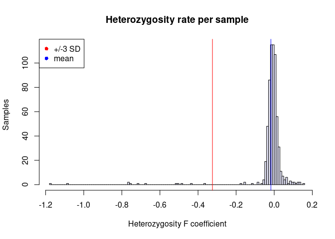

# "Quality control pipeline"
## author: "Juliana Acosta-Uribe"
### date: '2023-06-28'


This pipeline is designed to be run as an [R markdown](https://rmarkdown.rstudio.com/lesson-1.html) file in R Studio. This way you can run it in a step-by-step mode. However, you could also run it directly from the r command line if you already have the `sample_data.txt` and the `problematic_relatedness.txt` files in your workspace.

```         
library(rmarkdown)
render("path/to/your/file.Rmd")
```

For this pipeline you will need the following:

### Data:

A plink formatted .*bed*, .*fam*, .*bim* set, or a bgzipped *.vcf.gz* file.

**Always Take a look at the files before beginning:**\
If you start with a plink dataset:\
- Do the Individual IDs (column 2 in *.fam*) match what you were expecting?\
- Have the families been given a Family ID (column 1 in *.fam*)?\
- Do the Individuals have their sex assigned (column 5 in *.fam*?\
- Do the variants in the *.bim* have an identifier (column 2 in *.bim*)? Some analyses will require this information, and we may have to incorporate it to the *.fam*/*.bim* if its not already there.\
Make sure your files are properly aligned and the alleles are being called from the correct strand. INDELs should be [left aligned and normalized](https://samtools.github.io/bcftools/bcftools.html#norm).

If you are starting with a *.vcf*, or your *.fam* does not have the sex /family of the samples already specified please provide an additional file `sample_data.txt` with a header as follows:

**IID** ID of the sample as it is in the plink IID or in the VCF\
**SEX** should be specified (1=male, 2=female, 0=no data)\
**FID** Family ID of the sample\
**PID** Paternal ID of the sample, if the individual is also in the dataset, the PID should be identical to their fathers IID\
**MID** Maternal ID of the sample, if the individual is also in the dataset, the PID should be identical to their mothers IID\
**PHENO** Optional, if you are interested in any downstream analyses involving the phenotype. (1=control, 2=case, -9=missing)

⚠️ The **FID** given to the parents needs to match the same **FID** given to that individual for their genome.

A trio would look like this (order of the columns does not matter)

| FID  | IID | PID | MID | SEX | PHENO |
|------|-----|-----|-----|-----|-------|
| FID1 | SON | DAD | MOM | 1   | 2     |
| FID1 | MOM | 0   | 0   | 2   | 1     |
| FID1 | DAD | 0   | 0   | 1   | 1     |

R is expecting a tab delimited file. If your file is delimited by spaces you can fix it with the following bash command `sed -i 's/ /\t/g'  sample_data.txt`

### Tools:

\-[R](https://www.r-project.org/)\
-[RStudio](https://posit.co/download/rstudio-desktop/)\
-[plink](https://www.cog-genomics.org/plink2/)\
-[king](https://www.kingrelatedness.com/)

If you are working with Exome or Genome data, you will also need:

\-[vcftools](https://vcftools.github.io/man_latest.html)\
-[bcftools](https://samtools.github.io/bcftools/bcftools.html)

### Contents Table:

[1. Set up your environment](#section-1)\
[2. Customize the quality control process](#section-2)\
[3. Start Quality Control process](#section-3)\
[4. Genotype Quality control](#section-4)\
[5. Filter for missingness](#section-5)\
[6. Calculate heterozygosity](#section-6)\
[7. Check sex](#section-7)\
[8. Identify duplicates](#section-8)\
[9. Calculate relatedness](#section-9)\
[10. Remove variants & Individuals and with missingness ≥5%](#section-10)

## 1. Set up your environment {#section-1}

In this first step you will install the packages that R needs to run the quality control process and you will define the paths to your working directory and software.

``` r
# Install required R packages:
if (!require("knitr", quietly = TRUE))
install.packages("knitr")
library(knitr)

# Set your working directory:
knitr::opts_chunk$set(root.dir = "/home/acostauribe/Genetic-Sequencing_raw-data/HudsonAlpha_J.Nicholas.Cochran/redlat/redlat_QC", tidy=TRUE)
setwd("/home/acostauribe/Genetic-Sequencing_raw-data/HudsonAlpha_J.Nicholas.Cochran/redlat/redlat_QC")

# Set up path to software:
Sys.setenv(plink='/home/acostauribe/bin/plink')
Sys.setenv(king='/home/acostauribe/bin/king')
Sys.setenv(vcftools='/usr/bin/vcftools')
Sys.setenv(bcftools='/usr/bin/bcftools')

# Give the name of your starting file without the .bed or .vcf.gz extension
prefix='redlat_exome'
Sys.setenv(prefix=prefix)

# Define the type of data you will be working with. 
# Answers can be 'GENOME', 'EXOME', 'ARRAY'
data_type='EXOME'
Sys.setenv(data_type=data_type)

# Specify your reference genome
# Answers can be 'hg19', 'hg38'
genome_alignment='hg38'
Sys.setenv(genome_alignment=genome_alignment)

# Import-sample-data}
if (file.exists("sample_data.txt")) {
    sample_data = read.delim("sample_data.txt", header = TRUE, sep = '\t')
    print("Annotating .fam with provided sample_data.txt")
  } else { 
    print("No sample data was provided, assuming '.fam' already annotated") 
}
```

```         
## [1] "Annotating .fam with provided sample_data.txt"
```

## 2. Customize the quality control process {#section-2}

Choose what you want to do in the analysis:

``` r
# Do you want to do filter variant calls for genotype depth (DP) and Genotype
# Quality (GQ)?  This can only be done if you start with a VCF file and
# requires that the 'DP and 'GQ' FORMAT tag is included for each genotype.
# TRUE Includes only sites with DP/GQ (over all included individuals) greater
# than or equal to the given value
genotype_filter = TRUE
# Define the values you want to use as threshold
DP = 10
GQ = 20

# Do you want to keep only the variants with PASS in the VQSR filtering?  TRUE
# Removes all sites with a FILTER flag other than PASS.
vqsr_PASS = TRUE

# Do you want to check for known and cryptic relatedness among samples?  For
# this analyses you will need to provide information of known families as
# described before.  TRUE uses KING to perform relatedness check.
check_relatedness = TRUE

# Do you want to create directories and to organize your data as you go?  TRUE
# generates directories and organizes your files as you run the pipeline
tidy_up = TRUE

# Make these values into system environment variables
Sys.setenv(DP = DP)
Sys.setenv(GQ = GQ)
Sys.setenv(vqsr_PASS = vqsr_PASS)
Sys.setenv(check_relatedness = check_relatedness)
Sys.setenv(tidy_up = tidy_up)
```

## 3. Start Quality Control process {#section-3}

Before starting, take some time to look at your data and calculate some basic quality metrics. If you are starting with a vcf file from Exome or Genome data, after running the following chunk you should have at least the 6 following files:

**I. General statistics** [.vchk](https://samtools.github.io/bcftools/bcftools.html#stats)\
**II. Sample based metrics** [metrics](https://vcftools.sourceforge.net/man_latest.html#OUTPUT%20OPTIONS)\
1. missingness per sample (.imiss)\
2. depth per sample (.idepth)\
**III. Site based metrics**\
1. Missingness per site (.lmiss)\
2. Mean depth per site (.ldepth.mean)\
3. VQSR quality [vqsr](https://gatk.broadinstitute.org/hc/en-us/articles/360035531612-Variant-Quality-Score-Recalibration-VQSR-)

If your starting dataset is a plink file from a snp array, you will only get missingness per sample and per site.

``` bash
if [ $data_type == 'EXOME' ] || [ $data_type == 'GENOME' ]
then
    # Data description
    bcftools stats ${prefix}.vcf.gz > ${prefix}.preqc.vchk.txt
    
    # Individual missingness
    vcftools --gzvcf ${prefix}.vcf.gz --missing-indv --out ${prefix}.preqc
    # Generates a file reporting the missingness on a per-individual basis.
    # The output file has the suffix ".imiss".
    # Individuals whose missingness is >10% should be added to 'flagged_samples' file
    
    # Individual depth
    vcftools --gzvcf ${prefix}.vcf.gz --depth --out ${prefix}.preqc
    # Generates a file containing the mean depth per individual.
    # This file has the suffix ".idepth".
    #  Individuals whose mean depth is <20 should be added to 'flagged_samples' file
    
    # Site missingness
    vcftools --gzvcf ${prefix}.vcf.gz --missing-site --out ${prefix}.preqc
    # Generates a file reporting the missingness on a per-site basis.
    # The file has the suffix ".lmiss".
    
    # Site depth
    vcftools --gzvcf ${prefix}.vcf.gz --site-mean-depth --out ${prefix}.preqc
    # Generates a file containing the mean depth per site across all individuals.
    # This output file has the suffix ".ldepth.mean"
    
    # VQRS filtering
    vcftools --gzvcf ${prefix}.vcf.gz --FILTER-summary --out ${prefix}.preqc
    # Gives the information on the number of variants that passed VQSR filtering, or are in specific tranches
    # The output file has the suffix ".FILTER.summary"
else
    # Use plink for Site and individual missingness in SNP Array. 
    $plink --bfile ${prefix} --missing --out ${prefix}.preqc
    # It will produce .lmiss and .imiss files
fi
```

```         
## VCFtools - 0.1.16
## (C) Adam Auton and Anthony Marcketta 2009
## 
## Parameters as interpreted:
##  --gzvcf redlat_exome.vcf.gz
##  --missing-indv
##  --out redlat_exome.preqc
## 
## Using zlib version: 1.2.11
## After filtering, kept 642 out of 642 Individuals
## Outputting Individual Missingness
## After filtering, kept 410452 out of a possible 410452 Sites
## Run Time = 43.00 seconds
## 
## VCFtools - 0.1.16
## (C) Adam Auton and Anthony Marcketta 2009
## 
## Parameters as interpreted:
##  --gzvcf redlat_exome.vcf.gz
##  --depth
##  --out redlat_exome.preqc
## 
## Using zlib version: 1.2.11
## After filtering, kept 642 out of 642 Individuals
## Outputting Mean Depth by Individual
## After filtering, kept 410452 out of a possible 410452 Sites
## Run Time = 54.00 seconds
## 
## VCFtools - 0.1.16
## (C) Adam Auton and Anthony Marcketta 2009
## 
## Parameters as interpreted:
##  --gzvcf redlat_exome.vcf.gz
##  --out redlat_exome.preqc
##  --missing-site
## 
## Using zlib version: 1.2.11
## After filtering, kept 642 out of 642 Individuals
## Outputting Site Missingness
## After filtering, kept 410452 out of a possible 410452 Sites
## Run Time = 44.00 seconds
## 
## VCFtools - 0.1.16
## (C) Adam Auton and Anthony Marcketta 2009
## 
## Parameters as interpreted:
##  --gzvcf redlat_exome.vcf.gz
##  --out redlat_exome.preqc
##  --site-mean-depth
## 
## Using zlib version: 1.2.11
## After filtering, kept 410452 out of a possible 410452 Sites
## Run Time = 58.00 seconds
## 
## VCFtools - 0.1.16
## (C) Adam Auton and Anthony Marcketta 2009
## 
## Parameters as interpreted:
##  --gzvcf redlat_exome.vcf.gz
##  --FILTER-summary
##  --out redlat_exome.preqc
## 
## Using zlib version: 1.2.11
## After filtering, kept 642 out of 642 Individuals
## Outputting Filter Summary (for bi-allelic loci only)
## After filtering, kept 410452 out of a possible 410452 Sites
## Run Time = 24.00 seconds
```

You can then proceed to get some plots and statistics from your initial files.

**Sample based metrics**

``` r
if (!require("psych", quietly = TRUE)) install.packages("psych")
library(psych)
if (!require("dplyr", quietly = TRUE)) install.packages("dplyr")
```

``` r
library(dplyr)

# Individual Missingness
imiss = read.delim(file = paste0(prefix, ".preqc.imiss"), header = TRUE, sep = "")
# Generate basic summary statistics
imiss_F = describe(imiss$F_MISS)
rownames(imiss_F) = c("sample_missingness")
print(imiss_F)
```

```         
##                    vars   n mean sd median trimmed mad min  max range skew
## sample_missingness    1 642 0.01  0   0.01    0.01   0   0 0.02  0.01 1.21
##                    kurtosis se
## sample_missingness     3.61  0
```

``` r
# Plot Missingness rate per sample
imiss_hist = hist(imiss$F_MISS, xlab = "Missingness rate", ylab = "Samples", main = "Missingness rate per sample preQC",
    col = "lavender", breaks = 20)
```

<!-- -->

``` r
# Depth per Individual (Only for Exome or Genome data)
if (data_type == "EXOME" || data_type == "GENOME") {
    # Read depth calculations
    idepth = read.delim((paste0(prefix, ".preqc.idepth")), header = T, sep = "")

    # Generate basic summary statistics
    idepth_mean = describe(idepth$MEAN_DEPTH)
    rownames(idepth_mean) = c("sample_depth")
    print(idepth_mean)

    # Individuals whose mean depth is <20 should be identified
    low_mean_depth = filter(idepth, MEAN_DEPTH < 20)
    write.table(low_mean_depth, "samples_low_mean_depth_raw.txt", col.names = TRUE,
        row.names = TRUE, quote = FALSE, sep = "t")

    # Plot depth per sample
    idepth_hist = hist(idepth$MEAN_DEPTH, xlab = "Mean Depth ", ylab = "Samples",
        main = "Mean Depth per sample preQC", col = "lavender", breaks = 50)
}
```

```         
##              vars   n  mean  sd median trimmed  mad   min  max range skew
## sample_depth    1 642 55.15 7.2   54.7   54.97 5.74 30.29 86.7 56.41 0.39
##              kurtosis   se
## sample_depth     2.28 0.28
```

<!-- -->

Summarize your sample metrics

``` r
# Take the information of individuals from the .idepth file.  We are changing
# the names of the columns to specify these values come from raw data
sample_metrics = rename(idepth, Initial_n_sites = N_SITES, mean_initial_depth = MEAN_DEPTH)

# Using the 'match' function, we will create a new column in 'sample_metrics'
# with the missingness per sample.  imiss and idepth should have the same
# samples in the same order, but using the 'match' function will be useful when
# we start dropping samples
sample_metrics$initital_missingness = imiss$F_MISS[match(sample_metrics$INDV, imiss$INDV)]

# Save as a file
write.table(sample_metrics, "sample_metrics.txt", col.names = TRUE, row.names = FALSE,
    quote = FALSE)
```

**Site based metrics**

``` r
if (!require("ggplot2", quietly = TRUE)) install.packages("ggplot2")
```

``` r
library(ggplot2)

# Site Missingness
lmiss = read.delim(file = paste0(prefix, ".preqc.lmiss"), header = TRUE, sep = "")

# Generate basic summary statistics
lmiss_F = describe(lmiss$F_MISS)
rownames(lmiss_F) = c("site_missingness")
print(lmiss_F)
```

```         
##                  vars      n mean   sd median trimmed mad min max range  skew
## site_missingness    1 410452 0.01 0.06      0       0   0   0   1     1 11.97
##                  kurtosis se
## site_missingness   161.07  0
```

``` r
# Plot Missingness rate site per chromosome
lmiss_box = boxplot(F_MISS ~ CHR, 
                    data = lmiss, 
                    ylab = "Missingness rate", 
                    xlab = "Raw dataset",
    main = "Missingness rate per site preQC", col = "lavender")
```

<!-- -->

``` r
# Depth per site - chromosome (Only for Exome or Genome data)
if (data_type == "EXOME" || data_type == "GENOME") {
    # Read depth calculations
    ldepth = read.delim((paste0(prefix, ".preqc.ldepth.mean")), header = T, sep = "")

    # Generate basic summary statistics
    ldepth_mean = describe(ldepth$MEAN_DEPTH)
    rownames(ldepth_mean) = c("site_depth")
    print(ldepth_mean)
    ### Plot depth per site
    ldepth_box = boxplot(MEAN_DEPTH ~ CHROM, data = ldepth, xlab = "Mean Depth",
        ylab = "Sites", main = "Mean Depth per site preQC", col = "lavender")
}
```

```         
##            vars      n  mean    sd median trimmed  mad min    max  range skew
## site_depth    1 410452 55.15 37.69  41.14   47.29 5.26   0 710.61 710.61 3.61
##            kurtosis   se
## site_depth    21.17 0.06
```

<!-- -->

``` r
# Variant Quality Score Recalibration ranks (Only for Exome or Genome data)
if (data_type == "EXOME" || data_type == "GENOME") {
    vqsr = read.delim((paste0(prefix, ".preqc.FILTER.summary")), header = T, sep = "")
    print(vqsr)
    # Plot it
    vqsr %>%
        filter(!is.na(N_VARIANTS)) %>%
        arrange(N_VARIANTS) %>%
        mutate(FILTER = factor(FILTER, FILTER)) %>%
        ggplot(aes(x = FILTER, y = N_VARIANTS, label = N_VARIANTS)) + geom_segment(aes(x = FILTER,
        xend = FILTER, y = 0, yend = N_VARIANTS), color = "grey") + geom_point(size = 3,
        color = "#69b3a2") + geom_text(vjust = -1, size = 3) + coord_flip() + theme_minimal() +
        theme(panel.grid.minor.y = element_blank(), panel.grid.major.y = element_blank(),
            legend.position = "none") + scale_y_continuous(name = "Number of variants") +
        labs(title = "Variant Quality Score Recalibration ranks preQC")
    # ggsave('VQSR-preQC.png')
}
```

```         
##                          FILTER N_VARIANTS   N_Ts  N_Tv    Ts.Tv
## 1                          PASS     355118 256828 86654 2.963830
## 2   VQSRTrancheSNP99.90to100.00      36604  25409 11195 2.269670
## 3    VQSRTrancheSNP99.00to99.90      14034   9937  4097 2.425430
## 4 VQSRTrancheINDEL99.90to100.00       3125     65    40 1.625000
## 5  VQSRTrancheINDEL99.00to99.90       1571     11    19 0.578947
```

<!-- -->

Summarize statistical measures

``` r
if (data_type == "EXOME" || data_type == "GENOME") {
    statistical_measures = bind_rows(imiss_F, idepth_mean, lmiss_F, ldepth_mean)
} else {
    statistical_measures = bind_rows(imiss_F, lmiss_F)
}

write.table(statistical_measures, "statistical_measures.txt", col.names = TRUE, row.names = TRUE,
    quote = FALSE)
```

Organize all the generated files

``` bash
if [ $tidy_up == 'TRUE' ]
then
  mkdir Pre-QC_stats
  mv ${prefix}.preqc.* ./Pre-QC_stats
  mv samples_low_mean_depth_raw.txt ./Pre-QC_stats
fi
```

## 4. Genotype Quality control {#section-4}

This step is only possible to do when data is in a VCF file that has been properly annotated with genotype depth (DP) and genotype quality (GQ). Notice that no sites will be eliminated, as this only affects individual calls. For example if an individuals genotype for a given variant is below desired thresholds, its turned into a missing value in that individual.

``` bash
if [ $data_type == 'EXOME' ] || [ $data_type == 'GENOME' ]
then
  if [ $vqsr_PASS == 'TRUE'] 
  then
  $vcftools --gzvcf ${prefix}.vcf.gz --minDP $DP --minGQ $GQ --remove-filtered-all --recode --recode-INFO-all --out ${prefix}.DP$DP.GQ$GQ
  else
  $vcftools --gzvcf ${prefix}.vcf.gz --minDP $DP --minGQ $GQ --recode --recode-INFO-all --out ${prefix}.DP$DP.GQ$GQ
  fi
mv ${prefix}.DP$DP.GQ$GQ.recode.vcf  ${prefix}.DP$DP.GQ$GQ.vcf
bgzip ${prefix}.DP$DP.GQ$GQ.vcf
fi
```

```         
## VCFtools - 0.1.16
## (C) Adam Auton and Anthony Marcketta 2009
## 
## Parameters as interpreted:
##  --gzvcf redlat_exome.vcf.gz
##  --recode-INFO-all
##  --minDP 10
##  --minGQ 20
##  --out redlat_exome.DP10.GQ20
##  --recode
## 
## Using zlib version: 1.2.11
## After filtering, kept 642 out of 642 Individuals
## Outputting VCF file...
## After filtering, kept 410452 out of a possible 410452 Sites
## Run Time = 542.00 seconds
```

**Note**: VCFtools output can be compressed directly into a .gz file by adding `–stdout | gzip -c > newname.gz`, but it wont generate a .log file, which are useful for debugging.

Organize files

``` bash
if [ $tidy_up == 'TRUE' ]
then
  mkdir File_evolution
  mv ${prefix}.vcf.gz ./File_evolution
fi
```

Update prefix variable

``` r
if (data_type == "EXOME" || data_type == "GENOME") {
    prefix = (paste0(prefix, ".DP", DP, ".GQ", GQ))
    Sys.setenv(prefix = prefix)
}
```

## 5. Filter for missingness {#section-5}

Identify samples and variants missing more than 10% of data and remove them. The 10% or 0.1 threshold can be modified as desired.

``` bash
if [ $data_type == 'EXOME' ] || [ $data_type == 'GENOME' ]
then
  # Identify individuals with high missingness
  $vcftools --gzvcf ${prefix}.vcf.gz --missing-indv --out ${prefix}.mind
  awk '{if ($5 > 0.1) {print $1} }' ${prefix}.mind.imiss > ${prefix}.mind.irem
  awk '{if ($5 <= 0.1) {print $1} }' ${prefix}.mind.imiss > ${prefix}.mind.ikeep
  
  # Remove variants and sites missing more than 10% of data
  $vcftools --gzvcf ${prefix}.vcf.gz --keep ${prefix}.mind.ikeep --max-missing 0.9 --recode --recode-INFO-all --out ${prefix}.miss
  mv ${prefix}.miss.recode.vcf ${prefix}.miss.vcf
  bgzip ${prefix}.miss.vcf
  
  else 
  
  # Remove variants and samples missing more than 10% of data
  $plink --bfile ${prefix} --geno 0.1 --mind 0.1 --make-bed --out ${prefix}.miss
fi
```

```         
## 
## VCFtools - 0.1.16
## (C) Adam Auton and Anthony Marcketta 2009
## 
## Parameters as interpreted:
##  --gzvcf redlat_exome.DP10.GQ20.vcf.gz
##  --missing-indv
##  --out redlat_exome.DP10.GQ20.mind
## 
## Using zlib version: 1.2.11
## After filtering, kept 642 out of 642 Individuals
## Outputting Individual Missingness
## After filtering, kept 410452 out of a possible 410452 Sites
## Run Time = 55.00 seconds
## 
## VCFtools - 0.1.16
## (C) Adam Auton and Anthony Marcketta 2009
## 
## Parameters as interpreted:
##  --gzvcf redlat_exome.DP10.GQ20.vcf.gz
##  --keep redlat_exome.DP10.GQ20.mind.ikeep
##  --recode-INFO-all
##  --max-missing 0.9
##  --out redlat_exome.DP10.GQ20.miss
##  --recode
## 
## Using zlib version: 1.2.11
## Keeping individuals in 'keep' list
## After filtering, kept 642 out of 642 Individuals
## Outputting VCF file...
## After filtering, kept 389234 out of a possible 410452 Sites
## Run Time = 471.00 seconds
```

> Individuals missing more than 10% of the data get removed in this step. Removed individuals will be written to *prefix.mind.irem*

Update your sample_metrics file

``` r
if (data_type == "EXOME" || data_type == "GENOME") {
    imiss_qc = read.delim(paste0(prefix, ".mind.imiss"))
    sample_metrics$GQDP_missingness = imiss_qc$F_MISS[match(sample_metrics$INDV,
        imiss_qc$INDV)]
}
```

Tidy up

``` bash
if [ $tidy_up == 'TRUE' ]
then
  mkdir Missingness_stats
  mv ${prefix}.mind.* ./Missingness_stats
  
  if [ $data_type == 'GENOME' ] || [ $data_type == 'EXOME' ]
  then
  mv ${prefix}.vcf.gz ./File_evolution
  else
  mv ${prefix}.bed ./File_evolution
  mv ${prefix}.bim ./File_evolution
  mv ${prefix}.fam ./File_evolution
  fi
  
fi
```

Update prefix variable

``` r
prefix = (paste0(prefix, ".miss"))
Sys.setenv(prefix = prefix)
```

## 6. Calculate heterozygosity {#section-6}

This is a recommended step when you are analyzing cohorts with either SNP array or Whole genome sequencing.

We prefer plink to calculate sample heterozygosity. Plink uses a *sliding window* approach to identify variants in linkage disequilibrium. There are many options to modify the behavior or this approach in [plink's docummentation](https://www.cog-genomics.org/plink/1.9/ld#indep). The LD pruning requires that the *.bim* file has variant IDs in the second column. If no variants have been assigned, you could do a preliminary step using [--set-missing-var-ids](https://www.cog-genomics.org/plink/1.9/data#set_missing_var_ids).

``` bash
# If you have a vcf file, import it into plink 
if [ $data_type == 'GENOME' ] || [ $data_type == 'EXOME' ]
then
  $plink --vcf ${prefix}.vcf.gz --keep-allele-order --double-id --vcf-half-call h --set-missing-var-ids @:#$1,$2 --make-bed --out ${prefix}
fi

if [ $data_type == 'GENOME' ] || [ $data_type == 'ARRAY' ] || [ $data_type == 'EXOME' ]
then 
  # Retain variants with MAF > 10% and individuals with low missing %
  $plink --bfile ${prefix} --maf 0.1 --make-bed --out ${prefix}.maf
  
  # Calculate LD
  #--indep-pairwise <window size>['kb'] <step size (variant ct)> <r^2 threshold>
  $plink --bfile ${prefix}.maf --indep-pairwise 50 10 0.2 
  
  # Retain variants not in LD (independent markers)
  $plink --bfile ${prefix}.maf --extract plink.prune.in --make-bed --out ${prefix}.maf.ld
  
  # Check heterozygosity
  $plink --bfile ${prefix}.maf.ld --het --out ${prefix}.het
  
  # Calculate missingness rates
  $plink --bfile ${prefix} --missing --out ${prefix}
  
  rm ${prefix}.maf.*
  rm plink.*
  rm *.nosex
fi
```

```         
## PLINK v1.90b6.7 64-bit (2 Dec 2018)            www.cog-genomics.org/plink/1.9/
## (C) 2005-2018 Shaun Purcell, Christopher Chang   GNU General Public License v3
## Logging to redlat_exome.DP10.GQ20.miss.log.
## Options in effect:
##   --double-id
##   --keep-allele-order
##   --make-bed
##   --out redlat_exome.DP10.GQ20.miss
##   --set-missing-var-ids @:#,
##   --vcf redlat_exome.DP10.GQ20.miss.vcf.gz
##   --vcf-half-call h
## 
## 1031901 MB RAM detected; reserving 515950 MB for main workspace.
## 
--vcf: redlat_exome.DP10.GQ20.miss-temporary.bed +
## redlat_exome.DP10.GQ20.miss-temporary.bim +
## redlat_exome.DP10.GQ20.miss-temporary.fam written.
## 389234 variants loaded from .bim file.
## 69079 missing IDs set.
## 642 people (0 males, 0 females, 642 ambiguous) loaded from .fam.
## Ambiguous sex IDs written to redlat_exome.DP10.GQ20.miss.nosex .
## Using 1 thread (no multithreaded calculations invoked).
## Before main variant filters, 642 founders and 0 nonfounders present.
## Calculating allele frequencies... 
## Total genotyping rate is 0.997859.
## 389234 variants and 642 people pass filters and QC.
## Note: No phenotypes present.
## --make-bed to redlat_exome.DP10.GQ20.miss.bed + redlat_exome.DP10.GQ20.miss.bim
## + redlat_exome.DP10.GQ20.miss.fam ... 
## PLINK v1.90b6.7 64-bit (2 Dec 2018)            www.cog-genomics.org/plink/1.9/
## (C) 2005-2018 Shaun Purcell, Christopher Chang   GNU General Public License v3
## Logging to redlat_exome.DP10.GQ20.miss.maf.log.
## Options in effect:
##   --bfile redlat_exome.DP10.GQ20.miss
##   --maf 0.1
##   --make-bed
##   --out redlat_exome.DP10.GQ20.miss.maf
## 
## 1031901 MB RAM detected; reserving 515950 MB for main workspace.
## 389234 variants loaded from .bim file.
## 642 people (0 males, 0 females, 642 ambiguous) loaded from .fam.
## Ambiguous sex IDs written to redlat_exome.DP10.GQ20.miss.maf.nosex .
## Using 1 thread (no multithreaded calculations invoked).
## Before main variant filters, 642 founders and 0 nonfounders present.
## Calculating allele frequencies...  genotyping rate is 0.997859.
## 357438 variants removed due to minor allele threshold(s)
## (--maf/--max-maf/--mac/--max-mac).
## 31796 variants and 642 people pass filters and QC.
## Note: No phenotypes present.
## --make-bed to redlat_exome.DP10.GQ20.miss.maf.bed +
## redlat_exome.DP10.GQ20.miss.maf.bim + redlat_exome.DP10.GQ20.miss.maf.fam ...
## PLINK v1.90b6.7 64-bit (2 Dec 2018)            www.cog-genomics.org/plink/1.9/
## (C) 2005-2018 Shaun Purcell, Christopher Chang   GNU General Public License v3
## Logging to plink.log.
## Options in effect:
##   --bfile redlat_exome.DP10.GQ20.miss.maf
##   --indep-pairwise 50 10 0.2
## 
## 1031901 MB RAM detected; reserving 515950 MB for main workspace.
## 31796 variants loaded from .bim file.
## 642 people (0 males, 0 females, 642 ambiguous) loaded from .fam.
## Ambiguous sex IDs written to plink.nosex .
## Using 1 thread (no multithreaded calculations invoked).
## Before main variant filters, 642 founders and 0 nonfounders present.
## Calculating allele frequencies... 
## Total genotyping rate is 0.994451.
## 31796 variants and 642 people pass filters and QC.
## Note: No phenotypes present.
Pruned 1897 variants from chromosome 1, leaving 1315.
Pruned1131 variants from chromosome 2, leaving 884.
Pruned 976 variants from chromosome 3, leaving 696.
Pruned 602 variants from chromosome 4, leaving 573.
Pruned 811 variants from chromosome 5, leaving 568.
Pruned 1101 variants from chromosome 6, leaving 740.
Pruned 982 variants from chromosome 7, leaving 699.
Pruned 511 variants from chromosome 8, leaving 470.
Pruned 705 variants from chromosome 9, leaving 590.
Pruned 670 variants from chromosome 10, leaving 608.
Pruned 1513 variants from chromosome 11, leaving 755.
Pruned 929 variants from chromosome 12, leaving 668.
Pruned 262 variants from chromosome 13, leaving 255.
Pruned 592 variants from chromosome 14, leaving 426.
Pruned 528 variants from chromosome 15, leaving 391.
Pruned 834 variants from chromosome 16, leaving 460.
Pruned 1178 variants from chromosome 17, leaving 671.
Pruned 276 variants from chromosome 18, leaving 266.
Pruned 1821 variants from chromosome 19, leaving 942.
Pruned 395 variants from chromosome 20, leaving 351.
Pruned 216 variants from chromosome 21, leaving 189.
Pruned 446 variants from chromosome 22, leaving 312.
##uned 293 variants from chromosome 23, leaving 298.
## Pruning complete.  18669 of 31796 variants removed.
## Writing...
Marker lists written to plink.prune.in and plink.prune.out .
##
## PLINK v1.90b6.7 64-bit (2 Dec 2018)            www.cog-genomics.org/plink/1.9/
## (C) 2005-2018 Shaun Purcell, Christopher Chang   GNU General Public License v3
## Logging to redlat_exome.DP10.GQ20.miss.maf.ld.log.
## Options in effect:
##   --bfile redlat_exome.DP10.GQ20.miss.maf
##   --extract plink.prune.in
##   --make-bed
##   --out redlat_exome.DP10.GQ20.miss.maf.ld
## 
## 1031901 MB RAM detected; reserving 515950 MB for main workspace.
## 31796 variants loaded from .bim file.
## 642 people (0 males, 0 females, 642 ambiguous) loaded from .fam.
## Ambiguous sex IDs written to redlat_exome.DP10.GQ20.miss.maf.ld.nosex .
## --extract: 13127 variants remaining.
## Using 1 thread (no multithreaded calculations invoked).
## Before main variant filters, 642 founders and 0 nonfounders present.
## Calculating allele frequencies... 
## Total genotyping rate is 0.994281.
## 13127 variants and 642 people pass filters and QC.
## Note: No phenotypes present.
## --make-bed to redlat_exome.DP10.GQ20.miss.maf.ld.bed +
## redlat_exome.DP10.GQ20.miss.maf.ld.bim + redlat_exome.DP10.GQ20.miss.maf.ld.fam
##
## PLINK v1.90b6.7 64-bit (2 Dec 2018)            www.cog-genomics.org/plink/1.9/
## (C) 2005-2018 Shaun Purcell, Christopher Chang   GNU General Public License v3
## Logging to redlat_exome.DP10.GQ20.miss.het.log.
## Options in effect:
##   --bfile redlat_exome.DP10.GQ20.miss.maf.ld
##   --het
##   --out redlat_exome.DP10.GQ20.miss.het
## 
## 1031901 MB RAM detected; reserving 515950 MB for main workspace.
## 13127 variants loaded from .bim file.
## 642 people (0 males, 0 females, 642 ambiguous) loaded from .fam.
## Ambiguous sex IDs written to redlat_exome.DP10.GQ20.miss.het.nosex .
## Using 1 thread (no multithreaded calculations invoked).
## Before main variant filters, 642 founders and 0 nonfounders present.
## Calculating allele frequencies...
## Total genotyping rate is 0.994281.
## 13127 variants and 642 people pass filters and QC.
## Note: No phenotypes present.
## --het: 12829 variants scanned, report written to
## redlat_exome.DP10.GQ20.miss.het.het .
## PLINK v1.90b6.7 64-bit (2 Dec 2018)            www.cog-genomics.org/plink/1.9/
## (C) 2005-2018 Shaun Purcell, Christopher Chang   GNU General Public License v3
## Logging to redlat_exome.DP10.GQ20.miss.log.
## Options in effect:
##   --bfile redlat_exome.DP10.GQ20.miss
##   --missing
##   --out redlat_exome.DP10.GQ20.miss
## 
## 1031901 MB RAM detected; reserving 515950 MB for main workspace.
## 389234 variants loaded from .bim file.
## 642 people (0 males, 0 females, 642 ambiguous) loaded from .fam.
## Ambiguous sex IDs written to redlat_exome.DP10.GQ20.miss.nosex .
## Using 1 thread (no multithreaded calculations invoked).
## Before main variant filters, 642 founders and 0 nonfounders present.
## Calculating allele frequencies... 
## Total genotyping rate is 0.997859.
## --missing: Sample missing data report written to
## redlat_exome.DP10.GQ20.miss.imiss, and variant-based missing data report
## written to redlat_exome.DP10.GQ20.miss.lmiss.
```

**Identify heterozygosity outliers**

``` r
# Load data into R
het = read.delim(file = paste0(prefix, ".het.het"), header = TRUE, sep = "")

# Generate basic summary statistics
heterozygosity_sample = describe(het$F)
rownames(heterozygosity_sample) = c("Sample_heterozygosity")
print(heterozygosity_sample)
```

```         
##                       vars   n  mean  sd median trimmed  mad   min  max range
## Sample_heterozygosity    1 642 -0.02 0.1  -0.01   -0.01 0.02 -1.17 0.15  1.32
##                        skew kurtosis se
## Sample_heterozygosity -7.33    62.96  0
```

``` r
# Calculate limits for excluding samples [3 standard deviations] Low threshold
heterozygosity_low_limit = mean(het$F) - (3 * (sd(het$F)))
print(heterozygosity_low_limit)
```

```         
## [1] -0.3242389
```

``` r
## High threshold
heterozygosity_high_limit = mean(het$F) + (3 * (sd(het$F)))
print(heterozygosity_high_limit)
```

```         
## [1] 0.2891797
```

``` r
# Individuals whose heterozygosity deviated more than 3 SD from the mean should
# be identified
het_outlier_low = filter(het, F < heterozygosity_low_limit)
het_outlier_high = filter(het, F > heterozygosity_high_limit)
het_outlier_both = bind_rows(het_outlier_low, het_outlier_high)
het_outlier_id = select(het_outlier_both, FID, IID)

# Plot heterozygosity per sample
heterozygosity_hist = hist(het$F, freq = TRUE, xlab = "Heterozygosity F coefficient",
    ylab = "Samples", main = "Heterozygosity rate per sample", col = "lavender",
    breaks = 100)
abline(v = (heterozygosity_low_limit), col = "red")
abline(v = (heterozygosity_high_limit), col = "red")
abline(v = (mean(het$F)), col = "blue")
legend("topleft", c("+/-3 SD", "mean"), col = c("red", "blue"), pch = 16)
```

<!-- -->

> Heterozygosity outliers will be removed along with those that fail sex-check on next step.

It is useful to visualize heterozygosity F statistic vs. missingness per sample

``` r
# Load your data:
miss_imiss = read.delim(file = paste0(prefix, ".imiss"), header = TRUE, sep = "")

# Plot heterozygosity per sample
plot(imiss$F_MISS, het$F, xlab = "Missingness", ylab = "Heterozygosity", main = "Heterozygosity rate per sample - Data before QC")
abline(h = (heterozygosity_low_limit), col = "red")
abline(h = (heterozygosity_high_limit), col = "red")
abline(h = (mean(het$F)), col = "blue")
legend("bottomright", c("+/-3 SD", "mean"), col = c("red", "blue"), pch = 16)
```

<!-- -->

Update your Sample Metrics dataframe

``` r
sample_metrics$heterozygosity = het$F[match(sample_metrics$INDV, het$IID)]
write.table(sample_metrics, "sample_metrics.txt", col.names = TRUE, row.names = FALSE,
    quote = FALSE, sep = "t")

# Update your statistical_measure dataframe
statistical_measures = bind_rows(statistical_measures, heterozygosity_sample)
# Save as a file
write.table(statistical_measures, "statistical_measures.txt", col.names = TRUE, row.names = TRUE,
    quote = FALSE)
```

## 7. Check sex {#section-7}

**Preprocess sex chromosomes**

A. Verify that *prefix.fam* has a 'sex' value on the 5 column.

If the values are 0 or -9, you can assign 'sex value' in plink with the --update-sex command. You can also use R to edit the .fam by running the following chunk

``` r
# Load your dataframes
fam = read.delim(paste0(prefix, ".fam"), sep = " ", header = FALSE)

# If your .fam doesn't have the sex already specified, it will add the SEX from
# sample_data
if (sum(fam$V5) == 0) {
    fam$V5 = sample_data$SEX[match(fam$V2, sample_data$IID, nomatch = 0)]
    write.table(fam, paste0(prefix, ".fam"), col.names = FALSE, row.names = FALSE,
        quote = FALSE)
}
```

B. Split Pseudo-Autosomic region (PAR) of X

It is necessary to remove the PAR region of X for plink's sex check pipeline. This command will check if there is already a XY region in \${prefix}.bim if it doesn't find one it will split the PAR as chromosome 25. If there is already a chromosome 25, then it will append '.split-x' to ensure compatibility further on. Make sure you are using the correct genome alignment for this. e.g. ReDLat files are aligned to hg38. Set up `genome_alignment` variable accordingly You can find more information on this step in [plink docummentation](https://www.cog-genomics.org/plink/1.9/data#split_x)

``` bash
if [[ $(awk '$1 == "25" { count++ } END { print count }' ${prefix}.bim) == "" ]]
then 
$plink --bfile ${prefix} --split-x $genome_alignment --make-bed --out ${prefix}.split-x
else
mv ${prefix}.bed ${prefix}.split-x.bed
mv ${prefix}.bim ${prefix}.split-x.bim
mv ${prefix}.fam ${prefix}.split-x.fam
echo "plink files have been renamed" ${prefix}.split-x
fi
```

```         
## PLINK v1.90b6.7 64-bit (2 Dec 2018)            www.cog-genomics.org/plink/1.9/
## (C) 2005-2018 Shaun Purcell, Christopher Chang   GNU General Public License v3
## Logging to redlat_exome.DP10.GQ20.miss.split-x.log.
## Options in effect:
##   --bfile redlat_exome.DP10.GQ20.miss
##   --make-bed
##   --out redlat_exome.DP10.GQ20.miss.split-x
##   --split-x hg38
## 
## 1031901 MB RAM detected; reserving 515950 MB for main workspace.
## 389234 variants loaded from .bim file.
## 642 people (218 males, 424 females) loaded from .fam.
## Using 1 thread (no multithreaded calculations invoked).
## Before main variant filters, 642 founders and 0 nonfounders present.
## Calculating allele frequencies... 
## redlat_exome.DP10.GQ20.miss.split-x.hh ); many commands treat these as missing.
## Total genotyping rate is 0.997859.
## 389234 variants and 642 people pass filters and QC.
## Note: No phenotypes present.
## --split-x: 493 chromosome codes changed.
## --make-bed to redlat_exome.DP10.GQ20.miss.split-x.bed +
## redlat_exome.DP10.GQ20.miss.split-x.bim +
## redlat_exome.DP10.GQ20.miss.split-x.fam ... 
```

**Check sex in X chromosome**

``` bash
if [ $(awk -F' ' '{sum+=$5;}END{print sum;}' ${prefix}.split-x.fam) != '0' ]
then
# Retain X chromosome and calculate r2 between the variants in a given window
# This step requires that the .bim file has variant IDs in the second column
# it will generate two files: plink.prune.in y plink.prune.out
$plink --bfile ${prefix}.split-x --chr 23 --indep-pairwise 50 5 0.2

# Extract unlinked variants in x
$plink --bfile ${prefix}.split-x --extract plink.prune.in --make-bed --out ${prefix}.split-x.LD

# Calculate heterozygosity F statistic of X chromosome
$plink --bfile ${prefix}.split-x.LD  --check-sex 0.3 0.7 --out ${prefix}.split-x.chrX

rm plink.*
rm ${prefix}.split-x.LD.*

else
echo "Please edit the .fam with the sex of the samples"
fi
```

```         
## PLINK v1.90b6.7 64-bit (2 Dec 2018)            www.cog-genomics.org/plink/1.9/
## (C) 2005-2018 Shaun Purcell, Christopher Chang   GNU General Public License v3
## Logging to plink.log.
## Options in effect:
##   --bfile redlat_exome.DP10.GQ20.miss.split-x
##   --chr 23
##   --indep-pairwise 50 5 0.2
## 
## 1031901 MB RAM detected; reserving 515950 MB for main workspace.
## 8660 out of 389234 variants loaded from .bim file.
## 642 people (218 males, 424 females) loaded from .fam.
## Using 1 thread (no multithreaded calculations invoked).
## Before main variant filters, 642 founders and 0 nonfounders present.
## Calculating allele frequencies... 0
## treat these as missing.
## Total genotyping rate is 0.99657.
## 8660 variants and 642 people pass filters and QC.
## Note: No phenotypes present.
Pruned 3019 variants from chromosome 23, leaving 5641.
## Pruning complete.  3019 of 8660 variants removed.
## Writing...
Marker lists written to plink.prune.in and plink.prune.out .
## PLINK v1.90b6.7 64-bit (2 Dec 2018)            www.cog-genomics.org/plink/1.9/
## (C) 2005-2018 Shaun Purcell, Christopher Chang   GNU General Public License v3
## Logging to redlat_exome.DP10.GQ20.miss.split-x.LD.log.
## Options in effect:
##   --bfile redlat_exome.DP10.GQ20.miss.split-x
##   --extract plink.prune.in
##   --make-bed
##   --out redlat_exome.DP10.GQ20.miss.split-x.LD
## 
## 1031901 MB RAM detected; reserving 515950 MB for main workspace.
## 389234 variants loaded from .bim file.
## 642 people (218 males, 424 females) loaded from .fam.
## --extract: 5641 variants remaining.
## Using 1 thread (no multithreaded calculations invoked).
## Before main variant filters, 642 founders and 0 nonfounders present.
## Calculating allele frequencies... 
## redlat_exome.DP10.GQ20.miss.split-x.LD.hh ); many commands treat these as
## missing.
## Total genotyping rate is 0.996868.
## 5641 variants and 642 people pass filters and QC.
## Note: No phenotypes present.
## --make-bed to redlat_exome.DP10.GQ20.miss.split-x.LD.bed +
## redlat_exome.DP10.GQ20.miss.split-x.LD.bim +
## redlat_exome.DP10.GQ20.miss.split-x.LD.fam ... 
## PLINK v1.90b6.7 64-bit (2 Dec 2018)            www.cog-genomics.org/plink/1.9/
## (C) 2005-2018 Shaun Purcell, Christopher Chang   GNU General Public License v3
## Logging to redlat_exome.DP10.GQ20.miss.split-x.chrX.log.
## Options in effect:
##   --bfile redlat_exome.DP10.GQ20.miss.split-x.LD
##   --check-sex 0.3 0.7
##   --out redlat_exome.DP10.GQ20.miss.split-x.chrX
## 
## 1031901 MB RAM detected; reserving 515950 MB for main workspace.
## 5641 variants loaded from .bim file.
## 642 people (218 males, 424 females) loaded from .fam.
## Using 1 thread (no multithreaded calculations invoked).
## Before main variant filters, 642 founders and 0 nonfounders present.
## Calculating allele frequencies... 
## redlat_exome.DP10.GQ20.miss.split-x.chrX.hh ); many commands treat these as
## missing.
## Total genotyping rate is 0.996868.
## 5641 variants and 642 people pass filters and QC.
## Note: No phenotypes present.
## --check-sex: 5641 Xchr and 0 Ychr variant(s) scanned, 16 problems detected.
## Report written to redlat_exome.DP10.GQ20.miss.split-x.chrX.sexcheck .
```

Plot sex in X chromosome

``` r
if (!require("ggbeeswarm", quietly = TRUE)) install.packages("ggbeeswarm")
library(ggbeeswarm)

sex_X = read.delim(file = paste0(prefix, ".split-x.chrX.sexcheck"), header = TRUE,
    sep = "")

# Plot these coefficients comparing males vs. females Roughly you expect Female
# to have an F coefficient < 0.2-0.3 and males have an F coefficient > 0.7-0.8
# If there are individuals for which the fam has sex = 0 they will be plotted
# in an additional category called 'no data'
if (any(fam$V5 %in% "0")) {
    ggplot(sex_X, aes(x = factor(PEDSEX, labels = c("Not disclosed", "Male", "Female")),
        y = F, color = PEDSEX)) + geom_quasirandom(alpha = 0.7, size = 1.5) + labs(title = "Chromosomal sex assignement in samples based in X chromosome",
        x = "Disclosed sex", y = "F coefficient X chromosome") + theme_minimal() +
        theme(legend.position = "none")

} else {
    ggplot(sex_X, aes(x = factor(PEDSEX, labels = c("Male", "Female")), y = F, color = PEDSEX)) +
        geom_quasirandom(alpha = 0.7, size = 1.5) + labs(title = "Chromosomal sex assignement in samples based in X chromosome",
        x = "Disclosed sex", y = "F coefficient X chromosome") + theme_minimal() +
        theme(legend.position = "none")
}
```

<!-- -->

**Check sex according to Y chromosome**

``` bash
if [[ $(awk '$1 == "24" { count++ } END { print count }' ${prefix}.bim) != "" ]]
then 
  if [ $(awk -F' ' '{sum+=$5;}END{print sum;}' ${prefix}.split-x.fam) != "0" ]
  then
  $plink --bfile ${prefix}.split-x --check-sex y-only --out ${prefix}.split-x.chrY
  else
  echo "Please edit the .fam with the sex of the samples"
  fi
else
echo "Dataset does not contain Y chromosome, skipped Y chromosome sex check"
fi
```

```         
## Dataset does not contain Y chromosome, skipped Y chromosome sex check
```

Plot sex in Y chromosome

``` r
if (!require("ggbeeswarm", quietly = TRUE)) install.packages("ggbeeswarm")
library(ggbeeswarm)

# File path to search
Y_check_file = paste0(prefix, ".split-x.chrY.sexcheck")

# Check if the file exists
if (file.exists(Y_check_file)) {
    sex_Y = read.delim(file = paste0(prefix, ".split-x.chrY.sexcheck"), header = TRUE,
        sep = "")
} else {
    print("chrY.sexcheck file does not exist")
}
```

```         
## [1] "chrY.sexcheck file does not exist"
```

``` r
if (exists("sex_Y")) {
    # Plot the variant call count in chromosome Y If there are individuals for
    # which the fam has sex = 0 they will be plotted in an additional category
    # called 'no data'
    if (any(fam$V5 %in% "0")) {
        ggplot(sex_Y, aes(x = factor(PEDSEX, labels = c("No Data", "Male", "Female")),
            y = YCOUNT, color = PEDSEX)) + geom_quasirandom(alpha = 0.7, size = 1.5) +
            labs(title = "Chromosomal sex assignement in samples based in Y chromosome",
                x = "Disclosed sex", y = "Y chromosome variant count") + theme_minimal() +
            theme(legend.position = "none")

    } else {
        ggplot(sex_Y, aes(x = factor(PEDSEX, labels = c("Male", "Female")), y = YCOUNT,
            color = PEDSEX)) + geom_quasirandom(alpha = 0.7, size = 1.5) + labs(title = "Chromosomal sex assignement in samples based in Y chromosome",
            x = "Disclosed sex", y = "Y chromosome variant count") + theme_minimal() +
            theme(legend.position = "none")
    }
}
```

**Identify individuals that fail sex-check**

``` r
# Identify Identify individuals that fail in each chromosome test
fail_x = sex_X[sex_X$STATUS == "PROBLEM", ]
if (exists("sex_Y")) {
    fail_y = sex_Y[sex_Y$STATUS == "PROBLEM", ]
}

# Merge
if (exists("sex_Y")) {
    sex_fail = bind_rows(fail_x, fail_y)
} else {
    sex_fail = bind_rows(fail_x)
}

sex_fail_id = select(sex_fail, FID, IID)
```

These samples will be removed after identifying duplicates.

**Update your Sample Metrics dataframe with sex check**

Notice that this chunk expects at least sex check data at least in chromosome X

``` r
# Add the disclosed sex to samples
sample_metrics$PEDSEX = sex_X$PEDSEX[match(sample_metrics$INDV, sex_X$IID)]
# Add the calculated X chromosome sex
sample_metrics$X_SEX = sex_X$SNPSEX[match(sample_metrics$INDV, sex_X$IID)]
# Add the calculated X chromosome sex F statistic
sample_metrics$X_SEX_F = sex_X$F[match(sample_metrics$INDV, sex_X$IID)]

if (exists("sex_Y")) {
    # Add the calculated Y chromosome sex
    sample_metrics$Y_SEX = sex_Y$SNPSEX[match(sample_metrics$INDV, sex_Y$IID)]
    # Add the Y chromosome snp counts
    sample_metrics$Y_SEX_count = sex_Y$YCOUNT[match(sample_metrics$INDV, sex_Y$IID)]
}

# Save it as a file
write.table(sample_metrics, "sample_metrics.txt", col.names = TRUE, row.names = FALSE,
    quote = FALSE)
```

## 8. Identify duplicate samples {#section-8}

Notice that KING requires to add the `.bed` at the end of the input

``` bash
$king -b ${prefix}.bed --duplicate --rplot --prefix ${prefix}.king
```

```         
## KING 2.2.4 - (c) 2010-2019 Wei-Min Chen
## 
## The following parameters are in effect:
##                    Binary File : redlat_exome.DP10.GQ20.miss.bed (-bname)
## 
## Additional Options
##          Close Relative Inference : --related, --duplicate [ON]
##    Pairwise Relatedness Inference : --kinship, --ibdseg, --ibs, --homog
##               Inference Parameter : --degree
##          Relationship Application : --unrelated, --cluster, --build
##                         QC Report : --bysample, --bySNP, --roh, --autoQC
##                      QC Parameter : --callrateN, --callrateM
##              Population Structure : --pca, --mds
##               Structure Parameter : --projection, --pcs
##               Disease Association : --tdt
##    Quantitative Trait Association : --mtscore
##                 Association Model : --trait [], --covariate []
##             Association Parameter : --invnorm, --maxP
##                Genetic Risk Score : --risk, --model [], --prevalence, --noflip
##               Computing Parameter : --cpus
##                    Optional Input : --fam [], --bim [], --sexchr [23]
##                            Output :
##                                     --prefix [redlat_exome.DP10.GQ20.miss.king],
##                                     --rpath [], --rplot [ON]
## 
## KING starts at Wed Jun 28 06:32:55 2023
## Loading genotype data in PLINK binary format...
## Read in PLINK fam file redlat_exome.DP10.GQ20.miss.fam...
##   PLINK pedigrees loaded: 642 samples
## Read in PLINK bim file redlat_exome.DP10.GQ20.miss.bim...
##   Genotype data consist of 380081 autosome SNPs, 9153 X-chromosome SNPs
##   PLINK maps loaded: 389234 SNPs
## Read in PLINK bed file redlat_exome.DP10.GQ20.miss.bed...

  PLINK binary genotypes loaded.
  KING format genotype data successfully converted.
## Autosome genotypes stored in 5939 words for each of 642 individuals.
## 
## Options in effect:
##  --duplicate
##  --rplot
##  --prefix redlat_exome.DP10.GQ20.miss.king
## 
## Sorting autosomes...
## Computing pairwise genotype concordance starts at Wed Jun 28 06:32:56 2023
##   32 CPU cores are used...
##         Stage 1 (with 512 SNPs) screening ends at Wed Jun 28 06:32:56 2023
##         Stage 2 (with all SNPs) inference ends at Wed Jun 28 06:32:56 2023
## 1 pairs of duplicates with heterozygote concordance rate > 80% are saved in file redlat_exome.DP10.GQ20.miss.king.con
## 
##   32 additional pairs from screening stage not confirmed in the final stage
## 
## Duplicate plot is generated in redlat_exome.DP10.GQ20.miss.king_duplicateplot.pdf
## 
## KING ends at Wed Jun 28 06:32:57 2023
```

`--duplicate` identifies duplicates or MZ twins and generates the file *\${prefix}.con* Each line represents two samples that have heterozygote concordance rate \> 80%. These samples need to be carefully addressed to determine if they are *known* biological duplicates (e.g. same patient sequenced twice), or if they are supposed to be *different* samples. For the *known* biological duplicates, you should retain the genome with the best metrics. If the genomes are from *different* samples, both genomes should be removed (you cannot tell which one does the genome belong to)

> If you have known biological replicates I suggest to go over the duplicate list manually and decide which genome to exclude from each pair. If you are not expecting any duplicates, eliminate all of th

Make a list of duplicate samples:

``` r
duplicates_df = read.delim(paste0(prefix, ".king.con"), header = TRUE)
duplicate_1 = select(duplicates_df, FID1, ID1)
colnames(duplicate_1) = c("FID", "IID")
duplicate_2 = select(duplicates_df, FID2, ID2)
colnames(duplicate_2) = c("FID", "IID")
duplicates_id = bind_rows(duplicate_1, duplicate_2)
```

Generate a list of individuals that are heterozygosity outliers, fail sex checks and/or duplicate samples

``` r
if (!require("dplyr", quietly = TRUE)) install.packages("dplyr")
library(dplyr)

het_sex_dup = bind_rows(het_outlier_id, sex_fail_id, duplicates_id)

if (data_type == "EXOME" || data_type == "GENOME") {
    write.table(select(het_sex_dup, IID), "het_sex_dup.txt", col.names = FALSE, row.names = FALSE,
        quote = FALSE)
} else {
    write.table(het_sex_dup, "het_sex_dup.txt", col.names = FALSE, row.names = FALSE,
        quote = FALSE)
}
```

**Remove heterozygosity outliers, sex-fails and duplicates**

``` bash
if [ $data_type == 'GENOME' ] || [ $data_type == 'EXOME' ]
then
vcftools --gzvcf ${prefix}.vcf.gz --remove het_sex_dup.txt --recode --recode-INFO-all --out ${prefix}.het.sex.dup
mv  ${prefix}.het.sex.dup.recode.vcf ${prefix}.het.sex.dup.vcf
bgzip ${prefix}.het.sex.dup.vcf
else
plink --bfile ${prefix} --remove het_sex_dup.txt --make-bed --out ${prefix}.het.sex.dup
fi
```

```         
## 
## VCFtools - 0.1.16
## (C) Adam Auton and Anthony Marcketta 2009
## 
## Parameters as interpreted:
##  --gzvcf redlat_exome.DP10.GQ20.miss.vcf.gz
##  --remove het_sex_dup.txt
##  --recode-INFO-all
##  --out redlat_exome.DP10.GQ20.miss.het.sex.dup
##  --recode
## 
## Using zlib version: 1.2.11
## Excluding individuals in 'exclude' list
## After filtering, kept 615 out of 642 Individuals
## Outputting VCF file...
## After filtering, kept 389234 out of a possible 389234 Sites
## Run Time = 442.00 seconds
```

``` bash
if [ $tidy_up == 'TRUE' ]
then
  mkdir Duplicate_analysis
  mv ${prefix}.king* ./Duplicate_analysis
  mv het_sex_dup.txt ./Duplicate_analysis
  
  mkdir Sex_check
  mv ${prefix}.split-x.* ./Sex_check
  
  mkdir Heterozygosity_stats
  mv ${prefix}.het* ./Heterozygosity_stats
  mv ${prefix}.* ./File_evolution
  
  mv ./Heterozygosity_stats/${prefix}.het.sex.dup.* ./
  
  #mv ${prefix}.*miss ./Missingness_stats
fi
```

Update Prefix

``` r
prefix = (paste0(prefix, ".het.sex.dup"))
Sys.setenv(prefix = prefix)
```

## 9. Calculate relatedness {#section-9}

This is specially important if you are working with samples that you know have some relatedness between them, or if you are sampling from a small community. However it is optional and can be turned on/off in 2. Customize the quality control process 'check_relatedness'.

This process is done with the software [king](https://www.kingrelatedness.com/), which uses plink files as an input.

``` bash
# If you have a vcf file, import it into plink 
if [ $data_type == 'GENOME' ] || [ $data_type == 'EXOME' ]
then
  $plink --vcf ${prefix}.vcf.gz --keep-allele-order --double-id --vcf-half-call m --set-missing-var-ids @:#$1,$2 --make-bed --out ${prefix}
fi
```

```         
## PLINK v1.90b6.7 64-bit (2 Dec 2018)            www.cog-genomics.org/plink/1.9/
## (C) 2005-2018 Shaun Purcell, Christopher Chang   GNU General Public License v3
## Logging to redlat_exome.DP10.GQ20.miss.het.sex.dup.log.
## Options in effect:
##   --double-id
##   --keep-allele-order
##   --make-bed
##   --out redlat_exome.DP10.GQ20.miss.het.sex.dup
##   --set-missing-var-ids @:#,
##   --vcf redlat_exome.DP10.GQ20.miss.het.sex.dup.vcf.gz
##   --vcf-half-call m
## 
## 1031901 MB RAM detected; reserving 515950 MB for main workspace.
## 
--vcf: redlat_exome.DP10.GQ20.miss.het.sex.dup-temporary.bed +
## redlat_exome.DP10.GQ20.miss.het.sex.dup-temporary.bim +
## redlat_exome.DP10.GQ20.miss.het.sex.dup-temporary.fam written.
## 389234 variants loaded from .bim file.
## 69079 missing IDs set.
## 615 people (0 males, 0 females, 615 ambiguous) loaded from .fam.
## Ambiguous sex IDs written to redlat_exome.DP10.GQ20.miss.het.sex.dup.nosex .
## Using 1 thread (no multithreaded calculations invoked).
## Before main variant filters, 615 founders and 0 nonfounders present.
## Calculating allele frequencies... 
## Total genotyping rate is 0.997885.
## 389234 variants and 615 people pass filters and QC.
## Note: No phenotypes present.
## --make-bed to redlat_exome.DP10.GQ20.miss.het.sex.dup.bed +
## redlat_exome.DP10.GQ20.miss.het.sex.dup.bim +
## redlat_exome.DP10.GQ20.miss.het.sex.dup.fam ... 
```

**Check Relatedness**

In this step you verify that disclosed relatedness among individuals matches their genetic relatedness, additionally you search for the presence of cryptic relatedness between samples.

If the *.fam.* file does not have a Family Identifier per genome (FID), you need to incorporate that information. You can use Plink's [--update-ids](https://www.cog-genomics.org/plink/1.9/data#update_indiv).If you know that in your data set you have parent-offspring samples, its also useful to add this information to the fam with [--update-parents](https://www.cog-genomics.org/plink/1.9/data#update_indiv)

You can also use R to edit the *.fam* by running the following chunk

``` r
if (!require("kinship2", quietly = TRUE)) install.packages("kinship2")
library(kinship2)

# Load your dataframes
fam = read.delim(paste0(prefix, ".fam"), sep = " ", header = FALSE)

if (sum(fam$V5) == 0) {
    # Use match to replace the existing values in the .fam for those in
    # sample_data
    fam$V5 = sample_data$SEX[match(fam$V2, sample_data$IID)]
    # Replace the NA for 0
    fam$V5[is.na(fam$V5)] = 0
    write.table(fam, paste0(prefix, ".fam"), col.names = FALSE, row.names = FALSE,
        quote = FALSE)
}
# Use match to replace the existing values in the .fam for those in sample_data
fam$V1 = sample_data$FID[match(fam$V2, sample_data$IID, nomatch = 0)]
fam$V3 = sample_data$PID[match(fam$V2, sample_data$IID, nomatch = 0)]
fam$V4 = sample_data$MID[match(fam$V2, sample_data$IID, nomatch = 0)]

write.table(fam, paste0(prefix, ".fam"), col.names = FALSE, row.names = FALSE, quote = FALSE)
```

After editing the *.fam* you can proceed to check relatedness:

``` bash
$king -b ${prefix}.bed --related --rplot --degree 4 --cluster --prefix ${prefix}.king
```

```         
## KING 2.2.4 - (c) 2010-2019 Wei-Min Chen
## 
## The following parameters are in effect:
##                    Binary File : redlat_exome.DP10.GQ20.miss.het.sex.dup.bed (-bname)
## 
## Additional Options
##          Close Relative Inference : --related [ON], --duplicate
##    Pairwise Relatedness Inference : --kinship, --ibdseg, --ibs, --homog
##               Inference Parameter : --degree [4]
##          Relationship Application : --unrelated, --cluster [ON], --build
##                         QC Report : --bysample, --bySNP, --roh, --autoQC
##                      QC Parameter : --callrateN, --callrateM
##              Population Structure : --pca, --mds
##               Structure Parameter : --projection, --pcs
##               Disease Association : --tdt
##    Quantitative Trait Association : --mtscore
##                 Association Model : --trait [], --covariate []
##             Association Parameter : --invnorm, --maxP
##                Genetic Risk Score : --risk, --model [], --prevalence, --noflip
##               Computing Parameter : --cpus
##                    Optional Input : --fam [], --bim [], --sexchr [23]
##                            Output :
##                                     --prefix [redlat_exome.DP10.GQ20.miss.het.sex.dup.king],
##                                     --rpath [], --rplot [ON]
## 
## KING starts at Wed Jun 28 06:42:02 2023
## Loading genotype data in PLINK binary format...
## Read in PLINK fam file redlat_exome.DP10.GQ20.miss.het.sex.dup.fam...
##   PLINK pedigrees loaded: 615 samples
## Read in PLINK bim file redlat_exome.DP10.GQ20.miss.het.sex.dup.bim...
##   Genotype data consist of 380081 autosome SNPs, 9153 X-chromosome SNPs
##   PLINK maps loaded: 389234 SNPs
## Read in PLINK bed file redlat_exome.DP10.GQ20.miss.het.sex.dup.bed...
  PLINK binary genotypes loaded.
## 94%
  KING format genotype data successfully converted.
## Autosome genotypes stored in 5939 words for each of 615 individuals.
## 
## Options in effect:
##  --related
##  --degree 4
##  --rplot
##  --prefix redlat_exome.DP10.GQ20.miss.het.sex.dup.king
## 
## Sorting autosomes...
## Total length of 62 chromosomal segments usable for IBD segment analysis is 1133.6 MB.
##   In addition to autosomes, 4 segments of length 51.4 MB on X-chr can be further used.
##   Information of these chromosomal segments can be found in file redlat_exome.DP10.GQ20.miss.het.sex.dup.kingallsegs.txt
## 
## Within-family kinship data saved in file redlat_exome.DP10.GQ20.miss.het.sex.dup.king.kin
## 
## Relationship summary (total relatives: 17 by pedigree, 85 by inference)
##   Source MZ  PO  FS  2nd 3rd OTHER
##   ===========================================================
##   Pedigree   0   9   0   8   0   68
##   Inference  0   9   65  11  0   0
## 
## Within-family X-chr IBD-sharing inference saved in file redlat_exome.DP10.GQ20.miss.het.sex.dup.kingX.kin
## Relationship inference across families starts at Wed Jun 28 06:42:03 2023
## 32 CPU cores are used...
#
                               Inference ends at Wed Jun 28 06:42:03 2023
## 
## Relationship summary (total relatives: 0 by pedigree, 17723 by inference)
##          MZ  PO  FS  2nd
##   =====================================================
##   Inference  0   0   0   17005
## 
## 
## Between-family relatives (kinship >= 0.02210) saved in file redlat_exome.DP10.GQ20.miss.het.sex.dup.king.kin0
##   X-Chr IBD-sharing inference saved in file redlat_exome.DP10.GQ20.miss.het.sex.dup.kingX.kin0
## Relationship plot is generated in redlat_exome.DP10.GQ20.miss.het.sex.dup.king_relplot.pdf
## MI error plots are generated in redlat_exome.DP10.GQ20.miss.het.sex.dup.king_MIerrorplot.pdf
## Unique family plot is generated in redlat_exome.DP10.GQ20.miss.het.sex.dup.king_uniqfam0plot.pdf
## 
## Up to 2nd-degree relatedness (across families) is supported at the moment.
## 
## Options in effect:
##  --cluster
##  --degree 2
##  --rplot
##  --prefix redlat_exome.DP10.GQ20.miss.het.sex.dup.king
## 
## Family clustering starts at Wed Jun 28 06:42:09 2023
## Autosome genotypes stored in 5939 words for each of 615 individuals.
## Sorting autosomes...
## Total length of 62 chromosomal segments usable for IBD segment analysis is 1133.6 MB.
##   In addition to autosomes, 4 segments of length 51.4 MB on X-chr can be further used.
##   Information of these chromosomal segments can be found in file redlat_exome.DP10.GQ20.miss.het.sex.dup.kingallsegs.txt
## 
## 32 CPU cores are used to compute the pairwise kinship coefficients...
## 
Clustering up to 2nd-degree relatives in families...
## Individual IDs are unique across all families.
## 
## Relationship summary (total relatives: 0 by pedigree, 14 by inference)
##          MZ  PO  FS  2nd
##   =====================================================
##   Inference  0   0   0   14
## 
## The following families are found to be connected
##   NewFamID  OriginalFamID                                     
##   KING1     F-PLO00053,F-PLO00250,F-LO00481,F-PLO00215,F-PLO00295,F-PLO00617,F-PBS0027,F-PLO00125,F-PLO00147,F-PLO00388,F-PLO00573,F-PSL00012
##   KING2     F-PLO00127,F-PLO00569
## 
## Update-ID information is saved in file redlat_exome.DP10.GQ20.miss.het.sex.dup.kingupdateids.txt
## 
## Pair-wise relatedness in newly clustered families saved in redlat_exome.DP10.GQ20.miss.het.sex.dup.kingcluster.kin.
## KING cluster analysis ends at Wed Jun 28 06:42:09 2023
## Plots of newly clustered families are generated in redlat_exome.DP10.GQ20.miss.het.sex.dup.king_clusterplot.pdf
## 
## KING ends at Wed Jun 28 06:42:10 2023
```

The output of this command produces two files: *{prefix}.king.kin* Relatedness in reported relationships *{prefix}.king.kin0* Inferred relatedness in 'unrelated' individuals. Each row above provides information for one pair of individuals. See [king documentation](https://www.kingrelatedness.com/manual.shtml#RELATED)

if you get `FATAL ERROR - Please correct problems with pedigree structure` it usually means that an individual who is, for example, listed as male but shows up as the mother of another individual or vice versa)

> ⚠️ HUMAN INPUT NEEDED: **YOU** need to manually analyze these two files and generate a table including the samples that have problematic relatedness and have to be excluded (*problematic_relatedness.txt*) If your data type is GENOME or EXOME: Each row should represent the individual ID of each sample If your data type is an ARRAY: Each row is `Family ID, IndividualID`. The given IDs must match those in the *.fam*

``` bash
# If you have provided a problematic_relatedness.txt file, it will remove the listed individuals.
if [ -f "problematic_relatedness.txt" ]
then
  if [ $data_type == 'GENOME' ] || [ $data_type == 'EXOME' ]
  then
  vcftools --gzvcf ${prefix}.vcf.gz --remove problematic_relatedness.txt --recode --recode-INFO-all --out ${prefix}.rel
  mv  ${prefix}.rel.recode.vcf ${prefix}.rel
  bgzip ${prefix}.rel.vcf
  else
  plink --bfile ${prefix} --remove problematic_relatedness.txt --make-bed --out ${prefix}.rel
  fi
else
echo "No 'problematic_relatedness.txt' file. No sample will be removed."
fi
```

```         
## No 'problematic_relatedness.txt' file. No sample will be removed.
```

``` bash
if [ $tidy_up == 'TRUE' ]
then
  mkdir Relatedness_stats
  mv ${prefix}.king* ./Relatedness_stats
fi
```

Update system prefix if you removed individuals

``` r
if (exists("problematic_relatedness.txt")) {
    prefix = (paste0(prefix, ".rel"))
    Sys.setenv(prefix = prefix)
}
```

**OPTIONAL: Check for Mendelian errors**

If you know you have trios, parent-offspring duos or multigenerational families in your data set, you can use these to your benefit and check for Mendelian inconsistencies. Plink offers different commands to [identify](https://www.cog-genomics.org/plink/1.9/basic_stats#mendel) and [remove](https://www.cog-genomics.org/plink/1.9/data#set_me_missing) this inconsistencies according to the individuals in your data set.

For plink formatted data we can use:

``` bash
if [$data_type == 'ARRAY']
then
$plink --bfile ${prefix} --set-me-missing --mendel-duos --make-bed --out ${prefix}.me
fi
```

```         
## bash: [EXOME: command not found
```

Update prefix

``` r
if (exists(paste0(prefix, ".me.bed"))) {
    prefix = (paste0(prefix, ".me"))
    Sys.setenv(prefix = prefix)
}
```

## 10. Remove variants & Individuals and with missingness ≥5% {#section-10}

After refining our data set we finally remove the variants and the individuals that are missing more than 5% of the data

``` bash
if [ $data_type == 'EXOME' ] || [ $data_type == 'GENOME' ]
then
  # Identify individuals with high missingness
  $vcftools --gzvcf ${prefix}.vcf.gz --missing-indv --out ${prefix}.mind-2
  awk '{if ($5 > 0.05) {print $1} }' ${prefix}.mind-2.imiss > ${prefix}.mind-2.irem
  awk '{if ($5 <= 0.05) {print $1} }' ${prefix}.mind-2.imiss > ${prefix}.mind-2.ikeep
  
  # Remove variants and sites missing more than 5% of data
  $vcftools --gzvcf ${prefix}.vcf.gz --keep ${prefix}.mind-2.ikeep --max-missing 0.95 --recode --recode-INFO-all --out ${prefix}.qc
  mv ${prefix}.qc.recode.vcf ${prefix}.qc.vcf
  bgzip ${prefix}.qc.vcf
  
  else 
  # Remove variants and samples missing more than 5% of data
  $plink --bfile ${prefix} --geno 0.05 --mind 0.05 --make-bed --out ${prefix}.qc
fi
```

```         
## 
## VCFtools - 0.1.16
## (C) Adam Auton and Anthony Marcketta 2009
## 
## Parameters as interpreted:
##  --gzvcf redlat_exome.DP10.GQ20.miss.het.sex.dup.vcf.gz
##  --missing-indv
##  --out redlat_exome.DP10.GQ20.miss.het.sex.dup.mind-2
## 
## Using zlib version: 1.2.11
## After filtering, kept 615 out of 615 Individuals
## Outputting Individual Missingness
## After filtering, kept 389234 out of a possible 389234 Sites
## Run Time = 38.00 seconds
## 
## VCFtools - 0.1.16
## (C) Adam Auton and Anthony Marcketta 2009
## 
## Parameters as interpreted:
##  --gzvcf redlat_exome.DP10.GQ20.miss.het.sex.dup.vcf.gz
##  --keep redlat_exome.DP10.GQ20.miss.het.sex.dup.mind-2.ikeep
##  --recode-INFO-all
##  --max-missing 0.95
##  --out redlat_exome.DP10.GQ20.miss.het.sex.dup.qc
##  --recode
## 
## Using zlib version: 1.2.11
## Keeping individuals in 'keep' list
## After filtering, kept 614 out of 615 Individuals
## Outputting VCF file...
## After filtering, kept 385459 out of a possible 389234 Sites
## Run Time = 449.00 seconds
```

Tidy up

``` bash
if [ $tidy_up == 'TRUE' ]
then
    mkdir Post-QC_stats
  mv *.mind-2.ikeep ./Post-QC_stats
  mv *.mind-2.irem ./Post-QC_stats
  mv *.mind-2.imiss ./Post-QC_stats
  mv ${prefix}.* ./File_evolution
  mv ./File_evolution/${prefix}.qc* ./
fi
```

And now you have a clean data set!

``` r
prefix = (paste0(prefix, ".qc"))
Sys.setenv(prefix = prefix)
```

If you feel like plotting your results, you can redo the plots from the 1st part:

``` bash
if [ $data_type == 'EXOME' ] || [ $data_type == 'GENOME' ]
then
  echo $data_type
    # Data description
    bcftools stats ${prefix}.vcf.gz > ${prefix}.post-qc.vchk.txt
    
    # Individual missingness
    vcftools --gzvcf ${prefix}.vcf.gz --missing-indv --out ${prefix}.post-qc

    # Individual depth
    vcftools --gzvcf ${prefix}.vcf.gz --depth --out ${prefix}.post-qc

    # Site missingness
    vcftools --gzvcf ${prefix}.vcf.gz --missing-site --out ${prefix}.post-qc
    
    # Site depth
    vcftools --gzvcf ${prefix}.vcf.gz --site-mean-depth --out ${prefix}.post-qc
    
    # VQRS filtering
    vcftools --gzvcf ${prefix}.vcf.gz --FILTER-summary --out ${prefix}.post-qc
else
    # Use plink for Site and individual missingness in SNP Array. 
    $plink --bfile ${prefix} --missing --out ${prefix}.post-qc
fi
```

```         
## VCFtools - 0.1.16
## (C) Adam Auton and Anthony Marcketta 2009
## 
## Parameters as interpreted:
##  --gzvcf redlat_exome.DP10.GQ20.miss.het.sex.dup.qc.vcf.gz
##  --missing-indv
##  --out redlat_exome.DP10.GQ20.miss.het.sex.dup.qc.post-qc
## 
## Using zlib version: 1.2.11
## After filtering, kept 614 out of 614 Individuals
## Outputting Individual Missingness
## After filtering, kept 385459 out of a possible 385459 Sites
## Run Time = 38.00 seconds
## 
## VCFtools - 0.1.16
## (C) Adam Auton and Anthony Marcketta 2009
## 
## Parameters as interpreted:
##  --gzvcf redlat_exome.DP10.GQ20.miss.het.sex.dup.qc.vcf.gz
##  --depth
##  --out redlat_exome.DP10.GQ20.miss.het.sex.dup.qc.post-qc
## 
## Using zlib version: 1.2.11
## After filtering, kept 614 out of 614 Individuals
## Outputting Mean Depth by Individual
## After filtering, kept 385459 out of a possible 385459 Sites
## Run Time = 49.00 seconds
## 
## VCFtools - 0.1.16
## (C) Adam Auton and Anthony Marcketta 2009
## 
## Parameters as interpreted:
##  --gzvcf redlat_exome.DP10.GQ20.miss.het.sex.dup.qc.vcf.gz
##  --out redlat_exome.DP10.GQ20.miss.het.sex.dup.qc.post-qc
##  --missing-site
## 
## Using zlib version: 1.2.11
## After filtering, kept 614 out of 614 Individuals
## Outputting Site Missingness
## After filtering, kept 385459 out of a possible 385459 Sites
## Run Time = 39.00 seconds
## 
## VCFtools - 0.1.16
## (C) Adam Auton and Anthony Marcketta 2009
## 
## Parameters as interpreted:
##  --gzvcf redlat_exome.DP10.GQ20.miss.het.sex.dup.qc.vcf.gz
##  --out redlat_exome.DP10.GQ20.miss.het.sex.dup.qc.post-qc
##  --site-mean-depth
## 
## Using zlib version: 1.2.11
## After filtering, kept 614 out of 614 Individuals
## Outputting Depth for Each Site
## After filtering, kept 385459 out of a possible 385459 Sites
## Run Time = 51.00 seconds
## 
## VCFtools - 0.1.16
## (C) Adam Auton and Anthony Marcketta 2009
## 
## Parameters as interpreted:
##  --gzvcf redlat_exome.DP10.GQ20.miss.het.sex.dup.qc.vcf.gz
##  --FILTER-summary
##  --out redlat_exome.DP10.GQ20.miss.het.sex.dup.qc.post-qc
## 
## Using zlib version: 1.2.11
## After filtering, kept 614 out of 614 Individuals
## Outputting Filter Summary (for bi-allelic loci only)
## After filtering, kept 385459 out of a possible 385459 Sites
## Run Time = 21.00 seconds
```

Plot missingess per variant and per individual *Before* and *After* the quality control process

**Individual based metrics**

``` r
# Individual Missingness
imiss_final = read.delim(file = paste0(prefix, ".post-qc.imiss"), header = TRUE,
    sep = "")
# Generate basic summary statistics
imiss_final_F = describe(imiss_final$F_MISS)
rownames(imiss_final_F) = c("final_sample_missingness")
print(imiss_final_F)
```

```         
##                          vars   n mean sd median trimmed mad min  max range
## final_sample_missingness    1 614    0  0      0       0   0   0 0.03  0.03
##                          skew kurtosis se
## final_sample_missingness 6.18    42.69  0
```

``` r
# Plot Missingness rate per sample
imiss_hist_final = hist(imiss$F_MISS, xlab = "Missingness rate", ylab = "Samples",
    main = "Missingness rate per sample post QC", col = "aquamarine", breaks = 20)
```

<!-- -->

``` r
# Compare with initial dataset
imiss_box_final = boxplot(imiss$F_MISS, imiss_final$F_MISS, xlab = "Missingness rate",
    ylab = "Samples", main = "Missingness rate per sample preQC vs postQC", col = c("lavender",
        "aquamarine"), names = c("preQC", "postQC"))
```

<!-- -->

``` r
# Depth per Individual (Only for Exome or Genome data)
if (data_type == "EXOME" || data_type == "GENOME") {
    # Read depth calculations
    idepth_final = read.delim((paste0(prefix, ".post-qc.idepth")), header = T, sep = "")
    # Generate basic summary statistics
    idepth_final_mean = describe(idepth_final$MEAN_DEPTH)
    rownames(idepth_final_mean) = c("final_sample_depth")
    print(idepth_final_mean)

    # Plot depth per sample
    idepth_hist_final = hist(idepth_final$MEAN_DEPTH, xlab = "Mean Depth", ylab = "Samples",
        main = "Mean Depth per sample postQC", col = "aquamarine", breaks = 50)
    idepth_box_final = boxplot(idepth$MEAN_DEPTH, idepth_final$MEAN_DEPTH, ylab = "Mean Depth",
        main = "Mean depth per sample preQC vs postQC", col = c("lavender", "aquamarine"),
        names = c("preQC", "postQC"))
}
```

```         
##                    vars   n  mean   sd median trimmed  mad  min   max range
## final_sample_depth    1 614 56.03 6.94  55.57   55.84 5.55 31.6 86.92 55.33
##                    skew kurtosis   se
## final_sample_depth 0.43     2.45 0.28
```

<!-- --><!-- -->

Update the Sample Metrics file:

``` r
sample_metrics$Final_n_sites = idepth_final$N_SITES[match(sample_metrics$INDV, idepth_final$INDV)]
sample_metrics$Final_mean_depth = idepth_final$MEAN_DEPTH[match(sample_metrics$INDV,
    idepth_final$INDV)]
sample_metrics$Final_missingness = imiss_final$F_MISS[match(sample_metrics$INDV,
    imiss_final$INDV)]
write.table(sample_metrics, "sample_metrics.txt", col.names = TRUE, row.names = FALSE,
    quote = FALSE, sep = "t")
```

**Site based metrics**

``` r
# Site Missingness
lmiss_final = read.delim(file = paste0(prefix,".post-qc.lmiss"), 
                    header = TRUE, 
                    sep = '')
# Generate basic summary statistics
lmiss_final_F= describe(lmiss_final$F_MISS)
rownames(lmiss_final_F) = c("final_site_missingness")
print(lmiss_final_F)
```

```         
##                        vars      n mean sd median trimmed mad min  max range
## final_site_missingness    1 385459    0  0      0       0   0   0 0.05  0.05
##                        skew kurtosis se
## final_site_missingness  6.5    48.84  0
```

``` r
# Plot Missingness rate site per chromosome
lmiss_box_final = boxplot(F_MISS ~ CHR,
                    data=lmiss_final,
                    ylab="Missingness rate",
                    xlab="Raw dataset", 
                    main="Missingness rate per site post-QC", # main label
                    col="lavender")
```

<!-- -->

``` r
# Depth per site - chromosome (Only for Exome or Genome data)
if(data_type=='EXOME' || data_type=='GENOME'){
  # Read depth calculations
  ldepth_final = read.delim((paste0(prefix,".post-qc.ldepth.mean")), header = T, sep = "")

  # Generate basic summary statistics
  ldepth_final_mean = describe(ldepth_final$MEAN_DEPTH)
  rownames(ldepth_final_mean) = c("final_sample_depth")
  print(ldepth_final_mean)
  # Plot depth per site
  ldepth_box_final = boxplot(MEAN_DEPTH ~ CHROM,
                       data=ldepth,
                       xlab="Mean Depth",
                       ylab="Sites",
                       main="Mean Depth per site preQC",
                       col="lavender")
}
```

```         
##                    vars      n  mean    sd median trimmed  mad   min   max
## final_sample_depth    1 385459 56.03 35.75  41.42    47.5 5.28 21.16 712.4
##                     range skew kurtosis   se
## final_sample_depth 691.25 3.82    22.94 0.06
```

<!-- -->

Update your statistical_measure dataframe

``` r
statistical_measures = bind_rows(statistical_measures, imiss_final_F, idepth_final_mean,
    lmiss_final_F, ldepth_final_mean)
# Save as a file (optional)
write.table(statistical_measures, "statistical_measures.txt", col.names = TRUE, row.names = TRUE,
    quote = FALSE)
```

Organize all the generated files

``` bash
if [ $tidy_up == 'TRUE' ]
then
  mv ${prefix}.post-qc.* ./Post-QC_stats
fi
```

**And done!! (pat yourself in the back)**
